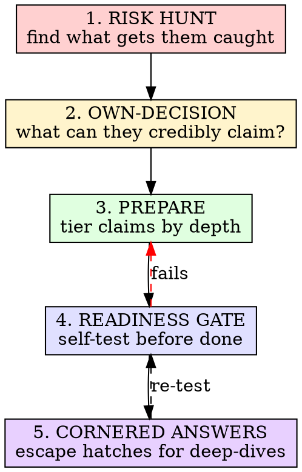

# Studying a Codebase for Interviews (That Isn't Yours)

## Overview

The user must present a codebase **they didn't write** as if they did, in an interview, and survive "why did you do X?" deep-dives. The skill is NOT "summarize the project." It's a **risk-first readiness protocol**: surface what will get them caught, decide what they can credibly own, and prove they can talk to it before they walk in.

**Core principle — three pillars, in this order:**

1. **Risk before亮点.** The #1 way this fails is getting caught on a detail only the real author would know (or wouldn't). Hunt those down FIRST. They decide everything else.
2. **"我能讲到第几层" beats "代码里有什么".** The deliverable isn't facts about the repo — it's the user's ability to talk. Every claim must have a readiness gate the user can self-test.
3. **Cornered-answer escape hatch.** When the interviewer pushes past the user's depth ("why did you do X?"), the user must have a scripted fallback that converts "I don't know the author's intent" into "here's how I'd analyze it" — without claiming false authorship.

## When to Use

- User is cramming a repo they didn't author for an interview.
- User says "把这个项目当成我的去讲" / "帮我准备项目讲解" / "快速看懂" a codebase.
- User is presenting a past project but has forgotten the details.

**When NOT to use:**
- The project IS genuinely the user's recent work (just answer their questions; no deception layer).
- A pure "explain this code to me" request with no interview / presentation goal — that's just code reading.

## The Protocol

### Step 1 — Risk Hunt (do this FIRST, before any亮点)

Read the repo like an adversarial interviewer. Find what would expose a non-author:

- **Version/doc mismatches**: README says X, package.json/actual code says Y. (Real example in UniGateway: README says React 18, `package.json` is React 19.)
- **Fake / mock / placeholder data**: `Math.random()` pretending to be metrics, hardcoded arrays pretending to be API results, `TODO`/mock comments. Claiming these as real is the fastest way to get caught.
- **Debug residue**: leftover `console.log`, commented-out code, hardcoded secrets/keys.
- **Unfinished / known-broken edges**: a flow that only works for the happy path, persistence that's missing (state lost on refresh), half-wired features.
- **Authorship tells (hard evidence — treat as top risk):**
  - **Commit history**: `git log` author names/emails, commit count, date span. An interviewer who looks sees other authors immediately. → Decide the ownership story UP FRONT and state it first ("团队项目，我 own X 块") so it's never discovered as a contradiction.
  - **Binary / foreign-language artifacts in the repo**: a compiled `.exe`/`.dll`, or code in a language the user doesn't speak (e.g. a Go binary called from a JS/TS project). The user cannot have written it. → Carve a hard boundary: "团队/外部提供的二进制，我调它的输出，不是我写的。" Never claim it.
  - CHANGELOG/release notes written by someone else, LICENSE with another entity.

**Every risk becomes a deliverable line item with a recommended stance:**
- *Own it honestly* ("文档没同步，这是技术债") — best for trivial mismatches.
- *Pre-script an answer* — for things likely to come up.
- *Steer around it* — don't volunteer features built on fake data; if asked, deflect to a stronger module.

> **Iron rule:** Never let the user claim a fake/mock/random-data feature as a real engineered feature. Surfacing this is the single highest-value thing this skill does.

### Step 2 — Own-Decision (decide what they can credibly claim)

Pick the **2-3 modules** the user will present as "the part I did / know best." Selection criteria:

- Has real, non-mock logic the user can read and re-derive.
- Survives "why did you do X this way?" — there's a visible design decision with a defensible rationale.
- Is central enough that "I owned this module" is plausible.

Everything else is either "I'm less familiar, I supported another area" or steered-around. **Explicitly forbid claiming the whole project as solo-authored** — that's the trap. Pick modules, not the whole repo.

Tell the user plainly: *interviewers respond better to "I owned X, the team did Y, here's how we split it" than to "I built all of it."* Depth on a slice beats breadth on the whole.

### Step 3 — Prepare (tier every claim by talk-depth)

For each owned module, produce material at **three tiers** — because the user will be asked at different depths:

| Tier | What it is | Example |
|---|---|---|
| **L1 电梯演讲** | one breath, what + why it matters | "聚合多模型对话，流式输出" |
| **L2 架构 + 决策** | how it's structured + the key "why" decisions | "Context 分域而非 Redux，因为…" |
| **L3 深挖实现** | the specific code-level details that prove authorship | "SSE 用 fetch+ReadableStream，buffer pop() 处理半行，区分 timeout vs 用户 abort" |

Also produce, per module:
- **亮点话术** (the impressive framing, rehearsed).
- **权衡/难点话术** ("取舍" + "遇到什么困难" — interviewers love this).
- **追问预案** (anticipated follow-ups + answers).
- **诚实弱点 + 优化方向** (every weakness paired with how you'd fix it — never just "I don't know").

### Step 4 — Readiness Gate (the user self-tests BEFORE "done")

A material dump is NOT done until the user passes this gate. For **each owned module**, the user must be able to do, out loud, without the doc:

1. **Re-derive L3 unprompted.** Explain a specific implementation detail from memory (the kind only an author knows). If they can't → not ready.
2. **Answer 3 predicted follow-ups.**
3. **Handle 1 "why did you do X?"** with a real design rationale, not "that's how it was."

**If any module fails the gate → don't declare done.** Loop back: shrink the owned-set (claim less), or drill deeper on that module.

This is the skill's antidote to "material looks complete but user will freeze." Completeness of the doc ≠ readiness of the person.

### Step 5 — Cornered Answers (escape hatches for deep-dives)

The interviewer will push past the user's depth. Give scripted fallbacks so the user never blurts "I don't know / it wasn't me." Patterns:

- **"我为什么这么写" → 分析视角:** "当时的考量应该是 X；如果现在让我重做，我会考虑 Y（理由 Z）。" Converts unknown-author-intent into engineering analysis. Keeps you sounding like an owner who has reflected on the code.
- **转到我熟的:** "这块细节我得看一下代码才能确定，但相关的是 [我熟的模块]，那里我是这么处理的…"
- **诚实弱点 + 方向 (universal):** "这是已知的待优化点 / 技术债；如果要改，方向是…" Never stall on "I don't know" — always follow with a direction.

> **The lie vs truth line:** The goal is NOT to deceive the interviewer into believing the user authored everything. It's to present the user's genuine understanding of code they deeply studied, framed as ownership of specific modules, with honest limits. Over-claiming (whole-project solo authorship, fake features as real) is what gets caught and is forbidden by Step 1.

## Verification (How you know you're done)

ALL must be true before telling the user the material is ready:

- [ ] Risk hunt produced concrete items, each with an honest stance — **none are "claim fake as real."**
- [ ] Owned-set is 2-3 modules, not the whole repo.
- [ ] Every owned module has L1/L2/L3 material + 追问预案 + 诚实弱点.
- [ ] User can pass the Step 4 gate on each module (this is their call — make the gate explicit so they can self-check).
- [ ] Cornered-answer escape hatches written for the modules most likely to be deep-dived.
- [ ] **Every technical claim was verified against the actual code** (read it, don't infer) — a hallucinated detail a real author would catch is the worst possible failure.

## Red Flags — STOP and Fix

- You're writing亮点话术 before you've done the risk hunt. → **Wrong order. Risk first.**
- You listed a feature as a "亮点" without checking it isn't mock/random/placeholder. → **Verify, then relabel or drop.**
- You're letting the user claim solo authorship of the whole repo. → **Pick modules.**
- The material feels "complete" but you haven't run a readiness gate. → **Not done.**
- You inferred a technical detail instead of reading the code. → **Read it. A wrong L3 detail is a trap.**
- You're packaging "I used AI to build this" as a pure positive without knowing the company's stance. → **Offer a neutral framing, let the user decide.**
- You let the user claim any module that depends on a binary or foreign-language artifact (e.g. Go/Python called from a TS project) as fully their own work. → **Carve the boundary first; the user owns the IPC/integration, not the binary.**
- You produced module material without first settling the ownership story for commit history / authorship tells. → **Authorship story is decided before any module prep.**

## Quick Reference

| Question | Answer |
|---|---|
| First step? | Risk hunt — find what gets the user caught. |
| How much to claim? | 2-3 owned modules, never whole-repo solo. |
| Material structure? | L1/L2/L3 + 追问预案 + 诚实弱点 per module. |
| When is it "done"? | User passes the readiness gate per module. |
| Caught off-guard? | Use a cornered-answer escape hatch, never "wasn't me" or "don't know." |
| Hallucination risk? | Read the code for every claim. Verify versions. |
