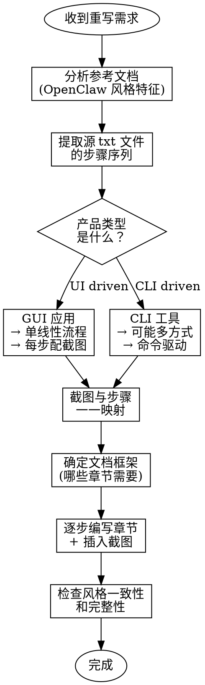

# 重写接入文档技能

## 概述

将产品接入文档从源步骤文本重组为结构化 Markdown，同时参考现有文档的风格标准。核心原则是：**内容来自源步骤（真实产品流程），结构和呈现参考目标风格（最佳实践）**。

## 何时使用

- 用户提供新的接入步骤 txt 文档
- 用户提供对应步骤的截图资源
- 需要参考现有文档（如 OpenClaw）的格式风格
- 目标是生成结构清晰、配图齐全的 Markdown 文档

## 核心步骤

### 第 1 步：分析参考文档的风格（GREEN 基础）

在开始重写前，先提取参考文档（如 `openclaw-配置.md`）的**风格特征**，不是复制内容。

**具体提取清单**：

| 风格要素 | 检查项 | 示例 |
|---------|--------|------|
| **前置块** | 文档说明 blockquote | `> **文档说明**\n> 本文介绍如何...` |
| **前置条件** | 清单格式、版本要求 | 用 `- ` 列出所有前提条件 |
| **配置步骤** | 分层标题（### / ####）、一步一说 | `### 方式一` / `#### 第 1 步` |
| **提示块** | 重要/关键信息的标记 | `> **重要提示**` 或 `> **关键信息**` |
| **代码块** | 命令/配置的展示格式 | ` ```bash ` 或 ` ```json ` |
| **表格** | 配置项说明、模型列表 | 3 列：项名 \| ID \| 说明 |
| **截图** | 图片引用格式和位置 | `` |
| **验证标志** | 成功标志的视觉标记 | `✅ **验证成功标志**：` |
| **错误排查** | 按问题分类（不是步骤序列） | `### API 错误` / `### 连接错误` |
| **模型列表** | 支持模型的表格 | 4 列：模型 \| ID \| 适用场景 \| 说明 |

**输出**：风格特征总结，形如"文档在前置条件后用 ### 分为两个配置方式，每个方式用 #### 编号步骤"。

---

### 第 2 步：理解源步骤文档的产品流程

阅读用户提供的 **txt 源步骤文档**，提取：

1. **步骤序列**：哪些操作必须按顺序执行，哪些可以并行或可选
2. **决策点**：是否存在"多种方式"（如 OpenClaw 的"自动 vs 手动"）
3. **配置项**：哪些需要用户填写（API Key、Base URL、模型 ID 等）
4. **验证方式**：如何确认配置成功
5. **常见问题**：txt 中提到的错误或注意事项

**关键判断**：
- 是单一线性流程（如 Flowise GUI 配置），还是多路径流程（如 OpenClaw 的自动/手动）？
- 是否需要在参考文档基础上添加"前置条件"或"故障排查"等章节？

---

### 第 3 步：关键决策 - 产品差异

在参考风格前，先判断**产品本质差异**，决定是否每个章节都适用。

**产品类型判断表**：

| 产品类型 | 典型特征 | 文档结构建议 |
|---------|---------|------------|
| **CLI 工具**（OpenClaw） | 命令行配置、多种安装方式、环境变量 | 可能需要"方式一/方式二"的并行结构 |
| **GUI 应用**（Flowise） | 可视化操作、点击流程、截图驱动 | 单一线性流程，每步配截图 |
| **SDK/库** | 代码集成、API 参数、配置文件 | 代码示例为主、参数表为辅 |
| **SaaS 平台** | 网页操作、表单填写、验证流程 | 操作步骤 + 截图 + 验证清单 |

**示例**：Flowise 是 GUI 应用，所以不需要"方式一/方式二"；但可以参考 OpenClaw 的"验证方式"和"故障排查"结构。

---

### 第 4 步：截图映射到步骤

用户提供了截图资源。为了正确插入，需要：

1. **梳理截图列表**：枚举所有用户提供的截图文件名
2. **识别每张截图的目的**：
   - 是"选择操作"（哪个按钮/菜单）的指示？
   - 是"填入数据"（要填什么内容）的示意？
   - 是"配置结果"（预期效果）的验证？
   - 是"最终验证"（功能是否工作）的证明？

3. **映射到步骤**：
   - 一张截图对应**一个明确的操作点**
   - 前置说明文字 → 截图展示 → 后续说明（如需要）
   - 避免"一张截图试图展示多个步骤"

**映射表示例**（基于 Flowise）：

| 截图文件名 | 步骤 | 目的 | 插入位置 |
|-----------|------|------|---------|
| `flowise新建chatflow.jpg` | 创建新 Chatflow | 指示在哪里点击"Add New" | 第 1 步后 |
| `flowise选择prompt template.jpg` | 添加 Prompt Template 节点 | 展示如何搜索和选择节点 | 第 2 步 - 2.1 后 |
| `flowise配置prompt template内容.jpg` | 配置 Prompt 内容 | 示范在哪个字段填入提示词 | 第 3 步内容说明后 |
| `flowise填入openai的api-key.jpg` | 填入 API Key 凭证 | 展示凭证配置对话框 | 第 5 步凭证新增后 |

**关键规则**：
- 每张截图必须有清晰的标题描述 ``
- 截图应该"说明而不重复"文字说明
- 如果文字已经很清楚，截图就是可选的；如果涉及 UI 定位，截图是必须的

---

### 第 5 步：建立文档结构框架

根据参考文档 + 产品类型，建立**标准章节顺序**：

```
1. # 产品名称 接入 UniGateway
2. > **文档说明** blockquote
3. ## 前置条件
4. ## 配置步骤
   (可能包含 ### 方式一 / ### 方式二，或仅 ### 第 N 步)
5. ## 最后验证
6. ## 支持的模型（如适用）
7. ## 故障排查
8. （可选）## 常见问题 / ## 相关资源
```

**判断何时需要各章节**：

| 章节 | 何时包含 | 何时省略 |
|-----|--------|--------|
| **前置条件** | 总是包含 | 从不省略 |
| **配置步骤** | 总是包含 | 从不省略 |
| **最后验证** | 总是包含 | 从不省略 |
| **支持的模型** | 有模型列表切换需求 | CLI 工具固定模型或 API 动态模型 |
| **故障排查** | 常见错误多于 1 个 | 如果整个流程非常直线 |
| **方式一/方式二** | 产品有多条并行路径 | GUI 类产品通常单路径 |

---

### 第 6 步：逐步编写 + 插入截图

按照文档框架，逐个章节编写内容：

#### 6.1 文档说明 + 前置条件

```markdown
# Flowise 接入 UniGateway

> **文档说明**
>
> 本文介绍如何将 Flowise 接入 UniGateway，
> 并通过 UniGateway 的 OpenAI 兼容接口调用模型。

## 前置条件

开始前请确认已准备好以下内容：

- Flowise 实例已运行
- 已获取有效的 UniGateway API Key
```

**风格要点**：
- 用 blockquote 包装文档说明
- 前置条件用无序列表 `- `
- 提及关键资源（官网、控制台）用括号补充

#### 6.2 配置步骤 - 文字 + 截图组合

**单个步骤的标准模式**：

```markdown
### 第 N 步：[操作名称]

[简要说明操作的目的和流程 1-2 句]


[如需要，补充具体参数或注意事项]
```

**示例**：

```markdown
### 第 2 步：添加节点到画布

进入新创建的 Chatflow，点击左上角 **+** 按钮打开节点添加面板。


依次添加以下三个节点到画布：Prompt Template、OpenAI Custom Model、LLM Chain。
```

**关键规则**：
- 截图应在"说明后"或"说明中"，帮助理解操作
- 如果操作很复杂，可以拆分为 `#### 2.1`、`#### 2.2` 子步骤
- 重要参数（API Key、Base URL）用 backtick 高亮

#### 6.3 最后验证

```markdown
## 最后验证

### 测试对话

点击对话框按钮打开聊天界面，输入测试提示词来验证配置是否成功。

例如：

```
帮我给一家做运动鞋的公司起个名字
```


✅ **验证成功标志**：如果能够成功收到 AI 回复，则说明配置成功。
```

**风格要点**：
- 包含具体测试输入示例
- 用 ✅ 符号和粗体标记验证成功标志
- 截图展示预期结果

#### 6.4 故障排查

```markdown
## 故障排查

### API Key 错误或认证失败

**常见原因**：Key 格式、状态或配置项填写不正确。

**解决方案**：

1. 检查 API Key 格式是否正确（通常以 `sk-` 开头）
2. 登录 UniGateway 控制台，确认 Key 的订阅状态
3. 确认字段已填入正确的 API Key

### 连接失败或请求超时

**常见原因**：网络连通性或 Base URL 配置错误。

**解决方案**：

1. 确认 Base Path 为：`https://api.unigateway.ai/v1`
2. 检查网络连接是否正常
```

**风格要点**：
- 按问题类别分为 ### 小节（不是步骤序列）
- 每个问题包含"常见原因"和"解决方案"两部分
- 用有序列表 `1.` `2.` 表示排查步骤

---

### 第 7 步：相对路径和资源引用

**一致性检查**：

1. **图片路径**：
   - 参考文档用 `../../assets/xxx.png`
   - 你的文档应该用 `../../assets/flowise-xxx.jpg`（保持统一相对层级）

2. **外部链接**：
   - UniGateway 官网、模型列表、文档链接用完整 URL
   - 内部文档参考用相对路径（如有必要）

3. **代码块语言标记**：
   - 命令用 ` ```bash `
   - 配置文件用 ` ```json `
   - 提示词模板用 ` ``` ` 无标记

---

## 常见错误 + 防御

### ❌ 错误 1：盲目复制 OpenClaw 的"方式一/方式二"

**症状**：Flowise 文档也硬生生地分成"自动配置"和"手动配置"，虽然 Flowise 没有这两条路。

**为什么错误**：参考风格 ≠ 复制结构。OpenClaw 分方式是因为**产品的内在差异**（CLI vs GUI），不是因为"风格就要这样"。

**正确做法**：只有产品真的有多种配置路径（如 Flowise 未来也支持 API 自动化 + GUI 手动），才分方式。

---

### ❌ 错误 2：截图插入位置错误

**症状**：把"最终验证的截图"插在"第一步"，或者一张大截图试图说明 5 个步骤。

**为什么错误**：截图的目的是帮助定位和理解，位置错误会导致用户困惑。

**正确做法**：
- 每张截图对应一个明确的操作点
- 在操作说明后立即插入该步骤的截图
- 避免跳跃式或总结性截图（除非是"完整流程示意"明确标注）

---

### ❌ 错误 3：忽视产品本质

**症状**：参考文档提到"重启网关"，就在 Flowise 文档也加"重启 Flowise"，虽然 Flowise 是无状态的 SaaS。

**为什么错误**：机械性复制结构，不理解产品差异。

**正确做法**：
1. 先判断产品类型（CLI / GUI / SaaS / SDK）
2. 根据产品特性决定哪些章节真的需要
3. 参考风格（表格格式、提示标记），不参考内容假设

---

### ❌ 错误 4：前置条件不完整

**症状**：抄 OpenClaw 的前置条件，但没加 Flowise 自己的需求（如"Flowise 实例已运行"）。

**为什么错误**：用户一开始就不满足前置，后续步骤都白费。

**正确做法**：
- 检查 txt 源步骤中有没有"前置"相关的说明
- 从产品常识补充必要前置条件
- 前置条件应该是"用户在执行配置前必须完成"的任务

---

### ❌ 错误 5：模型列表不准确

**症状**：直接复制 OpenClaw 的模型列表到 Flowise，虽然 Flowise 支持的模型取决于 UniGateway 的完整模型列表。

**为什么错误**：模型列表应该是真实的、易维护的，不是一成不变的示例。

**正确做法**：
- 如果模型列表是固定的，直接复制 OpenClaw 的表格格式和内容
- 如果模型列表动态，添加"更多模型"的外链：`https://unigateway.ai/models`
- 在表格下注明"数据来源"或"更新时间"

---

### ❌ 错误 6：GUI 应用步骤过度分解

**症状**：把"添加三个节点"分成 7 个独立步骤（第 2、4、7 步分别添加，中间穿插 3、5、6 步配置），导致用户看不清整体流程。

**为什么错误**：破碎的步骤序列导致认知负荷高。GUI 应用应该按照用户的**操作逻辑单位**分步，而不是参考 CLI 工具的命令序列。

**正确做法**（GUI 应用的步骤分解）：
- 一个**逻辑操作单位** = 一个步骤（如"添加并配置 OpenAI Custom Model 节点"应该是一个 ### 步骤）
- 在该步骤下用 #### 子小节详细说明各个子操作
- 结果应该是 4-6 个主步骤（### 级别），而不是 8-10 个

**示例**：
```markdown
### 第 2 步：添加并配置节点

#### 2.1 添加 Prompt Template 节点
[说明 + 截图]

#### 2.2 添加并配置 OpenAI Custom Model 节点
[说明 + 创建凭证截图 + 填入参数截图]

#### 2.3 添加并配置 LLM Chain 节点
[说明 + 截图]
```

---

### ❌ 错误 7：遗漏或未引用现有截图

**症状**：用户提供了 12 张截图，但文档只引用了 10 张；或者一张截图被用于两个不同目的（如"配置 OpenAI 内容"既用于凭证配置又用于参数配置）。

**为什么错误**：
1. 遗漏截图浪费资源，用户会问"为什么给了这张图但文档里没用到？"
2. 一张截图两用会造成步骤混淆

**正确做法**：
- 在"第 4 步：截图映射"中枚举所有用户提供的截图
- 逐一确认每张截图的目的和插入位置
- 如果一张截图确实需要两个用途，明确说明"该截图中的上半部分用于步骤 X，下半部分用于步骤 Y"
- 如果截图暂未使用，明确标注为"可选"或"备用"

---

## 决策流程图



---

## 快速参考 - OpenClaw 风格的核心要素

下面是 OpenClaw 文档的可复用风格模板：

**blockquote 提示（三种）**：
```markdown
> **文档说明**
> 本文介绍如何...

> **重要提示**
> 将 `sk-...` 替换为真实 API Key

> **关键信息**
> 该命令只对当前终端会话生效
```

**步骤标题分层**：
```markdown
## 配置步骤

### 方式一：通过 XXX 配置（推荐）

#### 第 1 步：...
#### 第 2 步：...

### 方式二：手动配置
```

**表格示例 - 配置说明**：
```markdown
| 配置项 | 说明 |
| --- | --- |
| `agents.defaults` | 配置默认工作区与模型... |
| `models.providers.unigateway` | 新增 UniGateway 供应商... |
```

**表格示例 - 模型列表**：
```markdown
| 模型 | 模型 ID | 适用场景 |
| --- | --- | --- |
| GPT-5.5 | `gpt-5.5` | 综合能力旗舰模型 |
| Claude Opus 4.7 | `claude-opus-4-7` | 深度代码分析 |
```

**验证成功标志**：
```markdown
✅ **验证成功标志**：如果能够成功收到 AI 回复，则说明配置成功。
```

**故障排查分类**：
```markdown
## 故障排查

### 问题类别 1

**常见原因**：...

**解决方案**：
1. 步骤 1
2. 步骤 2

### 问题类别 2
```

---

## 实施检查清单

重写完成前，检查以下项：

- [ ] 文档标题、blockquote 文档说明已添加
- [ ] 前置条件章节完整（用户真正需要的所有前提）
- [ ] 配置步骤与源 txt 文件一一对应
- [ ] 每个操作步骤都有对应的截图（如适用）
- [ ] 截图路径使用一致的相对路径 `../../assets/`
- [ ] 最后验证章节包含测试用例和成功标志 ✅
- [ ] 故障排查按问题分类（不是步骤）
- [ ] 表格格式与 OpenClaw 风格一致
- [ ] 重要信息用 blockquote > 标记
- [ ] 代码块用正确的语言标记（bash/json/等）
- [ ] 外部链接使用完整 URL，内部链接使用相对路径
- [ ] 没有机械性复制 OpenClaw 的内容（如"重启网关"对 GUI 不适用）

---

## 真实例子

使用本技能重写的 Flowise 文档应该看起来像：

```
# Flowise 接入 UniGateway

> **文档说明**
> 本文介绍如何将 Flowise 接入 UniGateway...

## 前置条件

- Flowise 实例已运行
- 已获取有效的 UniGateway API Key

## 配置步骤

### 第 1 步：登录并创建 Chatflow

访问 Flowise 并在左侧选择 Chatflows，点击 Add New。


### 第 2 步：添加节点

...

## 最后验证

### 测试对话

输入"帮我给一家做运动鞋的公司起个名字"。


✅ **验证成功标志**：收到 AI 回复。

## 故障排查

### API Key 错误

**常见原因**：...
```

这就是应该看起来的样子。
